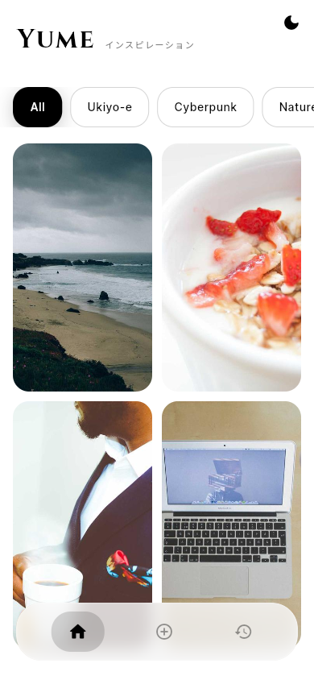
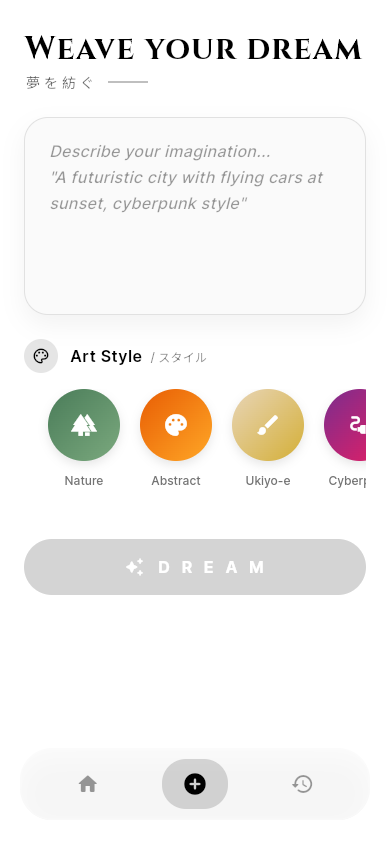

# 🌙 Yume - AI Wallpaper Generator

<div align="center">

**Dream your perfect wallpaper with AI**

A beautiful Flutter mobile app that generates stunning, personalized wallpapers using AI technology.

[](https://flutter.dev)
[](https://riverpod.dev)
[](https://opensource.org/licenses/MIT)

</div>

## ✨ Features

- 🎨 **AI-Powered Generation** - Create unique wallpapers using advanced AI models via Pollinations.ai
- 🌓 **Dark/Light Theme** - Beautiful Japanese minimalist design with seamless theme switching
- 📱 **Direct Wallpaper Application** - Set generated images as wallpaper with one tap (Android)
- 💾 **Local Storage** - Save your favorite wallpapers with Hive for offline access
- 🖼️ **Dynamic Gallery** - Browse featured wallpapers and your personal collection
- 🎭 **Style Options** - Multiple artistic styles (Cyberpunk, Vaporwave, Minimalist, Abstract, etc.)
- ⚡ **Optimized Performance** - Fast image generation with retry mechanisms for stability

## 📸 Screenshots

<p align="center">
  
  &nbsp;&nbsp;&nbsp;&nbsp;
  
</p>

## 📥 Download & Demo

Try the app on your Android device:

[](releases/yume-android-release.apk)

> **Note for iOS Users:**
> The iOS version requires a macOS environment to build. The project is fully configured for iOS (including icons and assets). To build for iOS:
> 1. Open the project on a Mac
> 2. Run `flutter build ipa`

## 🛠️ Tech Stack

- **Framework:** [Flutter](https://flutter.dev) 3.10.4+
- **State Management:** [Riverpod](https://riverpod.dev) 3.0 (with code generation)
- **Navigation:** [go_router](https://pub.dev/packages/go_router) 17.0
- **Networking:** [Dio](https://pub.dev/packages/dio) 5.7
- **Local Storage:** [Hive](https://pub.dev/packages/hive) 2.2 + Hive Flutter 1.1
- **UI Components:**
  - Staggered Grid View for dynamic layouts
  - Shimmer effects for loading states
  - Cached Network Images for performance
- **AI Provider:** [Pollinations.ai](https://pollinations.ai) (Free AI image generation)

## 🏗️ Architecture

This project follows **Clean Architecture** principles with a **Feature-First** folder structure:

```
lib/
├── core/
│   ├── constants/      # App-wide constants
│   ├── network/        # Dio client configuration
│   ├── router/         # GoRouter navigation setup
│   ├── services/       # Storage & other services
│   ├── theme/          # Theme configuration
│   ├── utils/          # Utility classes (Result pattern)
│   └── widgets/        # Reusable widgets
└── features/
    ├── create/         # AI wallpaper generation
    │   ├── data/       # DataSources, Repositories Implementation
    │   ├── domain/     # Models, Repository Interfaces
    │   └── presentation/ # UI, State Providers
    ├── home/           # Wallpaper gallery
    ├── preview/        # Wallpaper preview & actions
    └── history/        # User's wallpaper history
```

**Key Patterns:**

- **Clean Architecture:** Separation of Data, Domain, and Presentation layers
- **Repository Pattern:** Abstract data sources behind repository interfaces
- **Result Pattern:** Type-safe error handling with `Result<T>` wrapper
- **Provider Pattern:** Riverpod for dependency injection and state management

## 📋 Prerequisites

- **Flutter SDK:** 3.10.4 or higher
- **Dart SDK:** 3.10.4 or higher (included with Flutter)
- **IDE:** Android Studio, VS Code, or IntelliJ IDEA
- **Android:** Android Studio with SDK 21+ (for development)
- **Git:** For version control

## 🚀 Getting Started

### 1. Clone the Repository

```bash
git clone https://github.com/azizyuwono/yume-app.git
cd yume-app
```

### 2. Install Dependencies

```bash
flutter pub get
```

### 3. Run Code Generation

This app uses Riverpod code generation. Run this command to generate provider files:

```bash
dart run build_runner build --delete-conflicting-outputs
```

For development with auto-regeneration:

```bash
dart run build_runner watch --delete-conflicting-outputs
```

### 4. Run the App

```bash
flutter run
```

Or use the workflow:

- See [.agent/workflows/run.md](.agent/workflows/run.md) for run options

### 5. Build for Release

```bash
flutter build apk --release
```

Or use the workflow:

- See [.agent/workflows/build.md](.agent/workflows/build.md) for build instructions

## 🧪 Testing

Run all tests:

```bash
flutter test
```

Run tests with coverage:

```bash
flutter test --coverage
```

See [.agent/workflows/test.md](.agent/workflows/test.md) for more testing options.

## 📱 Supported Platforms

- ✅ **Android** (Primary focus - fully supported)
- ⏳ **iOS** (Structure ready, testing required)
- ⏳ **Web** (Structure ready, wallpaper setting not supported)

## 🤝 Contributing

Contributions are welcome! Please see [CONTRIBUTING.md](CONTRIBUTING.md) for details on:

- How to report bugs
- How to suggest features
- Code style guidelines
- Pull request process

## 📝 License

This project is licensed under the MIT License - see the [LICENSE](LICENSE) file for details.

## 🙏 Acknowledgments

- **Pollinations.ai** - For providing free AI image generation API
- **Flutter Team** - For the amazing framework
- **Riverpod** - For elegant state management
- **Community Contributors** - Thank you for your support!

## 📧 Contact

For questions or support, please open an issue on GitHub.

---

<div align="center">
Made with ❤️ using Flutter
</div>
